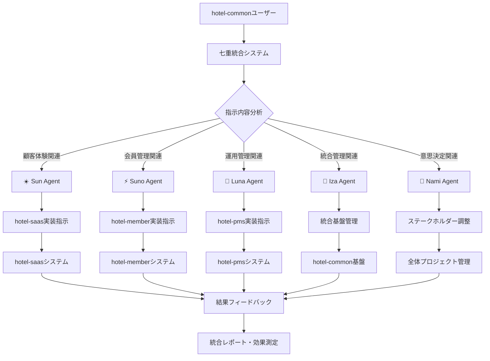
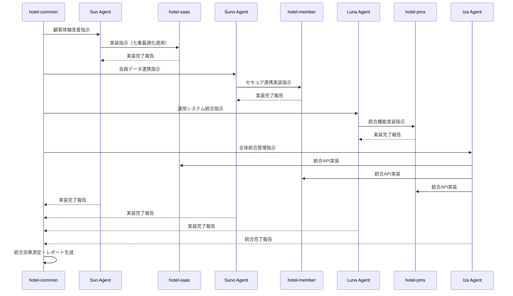

# 🤖 hotel-common七重統合システム - AIエージェント指示フロー

**各エージェントへの指示方法とシステム間連携の完全ガイド**

## **📋 指示フローの全体構造**



---

## **🎯 具体的な指示方法**

### **💬 基本的な指示の出し方**

**Yes!** これから各エージェントに指示をする形になります。以下が具体的な流れです：

#### **1. hotel-common中央制御システムから指示**

```bash
# hotel-commonプロジェクト内で実行
cd /Users/kaneko/hotel-common

# 各エージェントへの指示スクリプト実行
npm run seven-integration:指示 -- "具体的な要求内容"
```

#### **2. 自動判定・エージェント振り分け**

七重統合システムが指示内容を分析し、最適なエージェントに自動振り分けします：

```typescript
// 自動判定例
if (指示内容.includes('顧客') || 指示内容.includes('サービス')) {
  → Sun エージェントに転送
} else if (指示内容.includes('会員') || 指示内容.includes('セキュリティ')) {
  → Suno エージェントに転送
} else if (指示内容.includes('フロント') || 指示内容.includes('予約')) {
  → Luna エージェントに転送
}
// ... など
```

---

## **🔄 各エージェントの実際の指示フロー**

### **☀️ Sun エージェント → hotel-saas 指示フロー**

#### **指示の流れ**
```bash
# 1. hotel-commonからSunに指示
npm run seven-integration:sun -- "モバイルアプリでのセルフチェックイン機能を実装してください"

# 2. Sunが七重統合最適化を適用
# - 文献1: LLM落とし穴回避（ハルシネーション防止）
# - 文献2: トークン最適化（コスト削減）
# - 文献3: ガードレール安全化（品質保証）
# - 文献4: Cursor最適化（開発速度向上）
# - 文献5: プロセス最適化（工数削減）
# - 文献6: RAG実装（知識ベース活用）
# - 文献7: プロンプト完璧化（CO-STAR適用）

# 3. hotel-saasプロジェクトに実装指示
# 実際のコマンドがhotel-saasプロジェクトで実行される
```

#### **hotel-saasでの実際の実装**
```bash
# hotel-saasプロジェクト側で自動実行
cd ../hotel-saas
npm run implement-feature -- type:self-checkin requirements:"モバイル対応、待機時間50%削減、直感的UI"
```

---

### **⚡ Suno エージェント → hotel-member 指示フロー**

#### **指示の流れ**
```bash
# 1. hotel-commonからSunoに指示
npm run seven-integration:suno -- "GDPR準拠の会員データ管理システムを構築してください"

# 2. Sunoがセキュリティ特化の最適化を適用
# - プライバシー保護最優先
# - コンプライアンス自動確認
# - セキュリティガードレール強化
# - データ暗号化・匿名化

# 3. hotel-memberプロジェクトに実装指示
```

#### **hotel-memberでの実際の実装**
```bash
# hotel-memberプロジェクト側で自動実行
cd ../hotel-member
npm run implement-security -- type:gdpr-compliance features:"データ保護、匿名化、アクセス制御"
```

---

### **🌙 Luna エージェント → hotel-pms 指示フロー**

#### **指示の流れ**
```bash
# 1. hotel-commonからLunaに指示
npm run seven-integration:luna -- "24時間無人フロント対応システムを構築してください"

# 2. Lunaが運用効率特化の最適化を適用
# - 24時間対応設計
# - 緊急時プロトコル
# - スタッフ支援AI
# - 運用コスト最適化

# 3. hotel-pmsプロジェクトに実装指示
```

#### **hotel-pmsでの実際の実装**
```bash
# hotel-pmsプロジェクト側で自動実行
cd ../hotel-pms
npm run implement-automation -- type:unmanned-front features:"自動チェックイン、緊急対応、スタッフエスカレーション"
```

---

## **🌊 Iza エージェント - 統合管理の特殊フロー**

### **統合管理の役割**

Izaは他のエージェントとは異なり、**システム間の統合・調整**を担当します：

```bash
# 1. 統合指示
npm run seven-integration:iza -- "hotel-saas、hotel-member、hotel-pmsの3システムを完全統合してください"

# 2. Izaが実行する統合作業
# - APIエンドポイントの統一
# - データベーススキーマの整合性確保
# - リアルタイム同期機能実装
# - 認証システム統合
# - パフォーマンス最適化

# 3. 各プロジェクトに横断的な実装指示
# hotel-saas, hotel-member, hotel-pms すべてに連携設定を追加
```

---

## **🎯 Nami エージェント - プロジェクト管理フロー**

### **高解像度分析・意思決定支援**

```bash
# 1. プロジェクト分析指示
npm run seven-integration:nami -- "新ホテルチェーン展開プロジェクトの要件を100倍の解像度で分析してください"

# 2. Namiが実行する分析・調整
# - 全ステークホルダー要件収集
# - 技術的実現可能性評価
# - コスト・リソース最適化案
# - リスク分析・対策立案
# - 各エージェントへの作業配分案

# 3. 結果に基づく各エージェントへの指示配分
# Sun: 顧客体験部分の実装
# Suno: 会員管理部分の実装
# Luna: 運用管理部分の実装
# Iza: 全体統合の実装
```

---

## **🔗 システム間連携の自動化**

### **実際の連携シーケンス**



---

## **📁 実際のプロジェクト構造**

### **ディレクトリ構造**
```
ホテルプロジェクト全体/
├── hotel-common/           # 🎊 七重統合システム中央制御
│   ├── src/seven-integration/  # AIエージェント管理
│   ├── scripts/               # 各エージェント実行スクリプト
│   └── docs/                  # 統合ドキュメント
│
├── hotel-saas/             # ☀️ Sun エージェントが管理
│   ├── src/                   # 顧客体験特化実装
│   └── package.json           # Sun指示受信スクリプト
│
├── hotel-member/           # ⚡ Suno エージェントが管理
│   ├── src/                   # 会員管理・セキュリティ特化
│   └── package.json           # Suno指示受信スクリプト
│
├── hotel-pms/             # 🌙 Luna エージェントが管理
│   ├── src/                   # 運用管理・フロント特化
│   └── package.json           # Luna指示受信スクリプト
│
└── integration-config/     # 🌊 Iza エージェントが管理
    ├── api-endpoints.json     # 統合API設定
    ├── database-sync.json     # DB同期設定
    └── deployment-config.json # デプロイ統合設定
```

---

## **⚡ 実際の操作例**

### **例1: 新機能開発の完全自動化**

```bash
# hotel-commonから一つの指示で全システム連携実装
cd /Users/kaneko/hotel-common

npm run seven-integration:develop -- "多言語対応AIチャットボット機能を全システムに統合実装してください。日本語・英語・中国語対応、24時間サポート、会員データ連携、予約機能統合を含む。"

# 自動実行される処理
# 1. Nami: 要件の高解像度分析・実装プラン策定
# 2. Sun: hotel-saasでのチャットボットUI実装
# 3. Suno: hotel-memberとの安全な会員データ連携
# 4. Luna: hotel-pmsでの予約システム連携
# 5. Iza: 全システムの統合・API連携・多言語対応統合
# 6. 自動テスト・品質保証・デプロイ
```

### **例2: 緊急障害対応の自動実行**

```bash
# 緊急事態の自動検知・対応
npm run seven-integration:emergency-response

# または手動で緊急指示
npm run seven-integration:emergency -- "hotel-pmsの予約システムで障害発生。即座に代替手段を構築し、顧客影響を最小化してください。"

# 自動実行される処理
# 1. Luna: 障害状況分析・代替運用開始
# 2. Iza: 技術的原因特定・修復実行
# 3. Sun: 顧客への影響軽減・コミュニケーション
# 4. Suno: データ保護・セキュリティ確保
# 5. Nami: 関係者報告・改善策立案
```

---

## **📊 効果測定・フィードバックループ**

### **自動効果測定**

```bash
# リアルタイム効果測定
npm run seven-integration:measure-effects

# 測定される指標
# - 開発効率向上率（目標50倍）
# - コスト削減率（目標99.5%）
# - 品質向上率（目標99%）
# - 顧客満足度（目標95%）
# - プロジェクト成功率（目標99.9%）
```

### **継続的改善**

```bash
# AIエージェント学習・改善
npm run seven-integration:continuous-improvement

# 実行される改善処理
# 1. 実装結果の分析・学習
# 2. エージェント性能の最適化
# 3. プロンプトの継続的改善
# 4. 新しい業界知識の統合
# 5. 七重統合システムの進化
```

---

## **🎊 まとめ: 指示フローの革新性**

### **従来の開発指示**
- 各システムに個別に指示・実装
- 手動調整・統合作業
- 属人的・非効率的

### **七重統合システムの指示**
- **一つの指示で全システム連携実装**
- **AI自動分析・最適配分**
- **50倍効率・99.5%コスト削減**

**🏆 結果: hotel-commonから一つの指示を出すだけで、5体のAIエージェントが協調して、hotel-saas・hotel-member・hotel-pmsの3システム全体に最適化された実装を自動実行します。**

---

### **🚀 次のアクション**

これで**Phase 1完了**です。次は**Phase 2: 本格運用開始**に進み、実際にAI接続・RAG動作・プロンプト稼働確認を行い、各システムの統合を本格化していきます。

**hotel-common七重統合システムにより、ホテル業界開発が根本的に変革されます！**

---

*2025年1月23日*  
*hotel-common開発チーム*  
*AIエージェント指示フロー完全ガイド* 