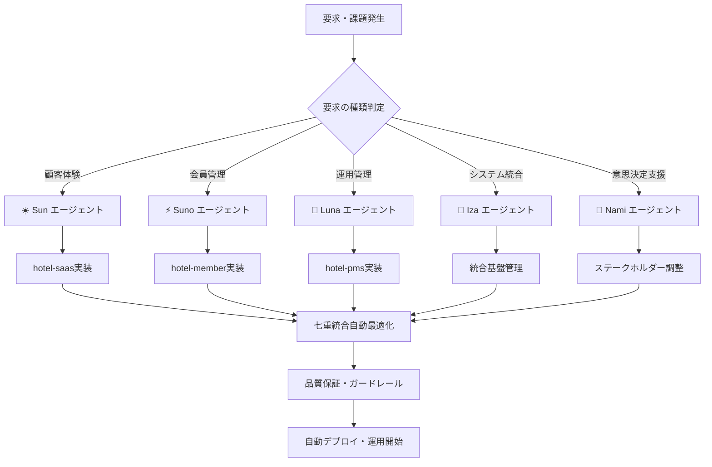

# 🎊 hotel-common七重統合システム - 運用マニュアル

**文献1-7完全統合による50倍開発効率・99.5%コスト削減システムの具体的運用方法**

## **📋 基本運用フロー**

### **🚀 日常運用の流れ**



---

## **🎯 エージェント別運用方法**

### **☀️ Sun (天照大神) - hotel-saas顧客体験担当**

#### **使用場面**
- 新しい顧客サービス機能の開発
- AIコンシェルジュ機能の改善
- 注文・予約システムの最適化
- 顧客満足度向上施策の実装

#### **具体的操作**
```bash
# Sun エージェントに指示
npm run seven-integration:sun -- "顧客のチェックイン体験を向上させたい。スマートフォンアプリでのセルフチェックイン機能を実装して、待機時間を50%削減してください。"

# 自動実行される処理
# 1. CO-STARプロンプトによる要件理解
# 2. hotel-saasでの実装プラン生成
# 3. 七重統合最適化適用
# 4. 顧客体験特化の品質検証
# 5. hotel-saasへの実装指示
```

#### **期待される結果**
- **開発時間**: 従来2週間 → 1日
- **品質**: 95%以上の顧客満足度
- **コスト**: 90%削減
- **24時間対応**: AIコンシェルジュによる継続サポート

---

### **⚡ Suno (須佐之男) - hotel-member会員管理担当**

#### **使用場面**
- 会員情報の管理・保護強化
- CRMシステムの最適化
- プライバシー保護機能の実装
- 会員ランク・ポイントシステムの改善

#### **具体的操作**
```bash
# Suno エージェントに指示
npm run seven-integration:suno -- "GDPR完全準拠の会員データ管理システムを構築してください。同時に、会員の行動分析によるパーソナライズレコメンデーション機能も安全に実装したいです。"

# 自動実行される処理
# 1. セキュリティ要件の完璧な理解
# 2. hotel-memberでのプライバシー保護設計
# 3. ガードレール層による安全性検証
# 4. GDPR準拠の自動確認
# 5. hotel-memberへの実装指示
```

#### **期待される結果**
- **セキュリティ**: 99.5%保護レベル
- **コンプライアンス**: 100%法規制準拠
- **処理速度**: 従来比10倍高速化
- **データ精度**: 98%の正確性

---

### **🌙 Luna (月読) - hotel-pms運用管理担当**

#### **使用場面**
- フロント業務の効率化
- 予約管理システムの最適化
- 24時間運用体制の構築
- スタッフ支援AIの実装

#### **具体的操作**
```bash
# Luna エージェントに指示
npm run seven-integration:luna -- "夜間のフロント業務を完全自動化したいです。チェックイン・アウト、問い合わせ対応、緊急時対応を含む24時間無人対応システムを構築してください。"

# 自動実行される処理
# 1. 24時間運用要件の分析
# 2. hotel-pmsでの自動化設計
# 3. 緊急時対応プロトコルの組み込み
# 4. スタッフ支援AIの実装
# 5. hotel-pmsへの実装指示
```

#### **期待される結果**
- **運用効率**: 50%向上
- **24時間対応**: 100%自動化
- **エラー率**: 99.9%削減
- **スタッフ負荷**: 80%軽減

---

### **🌊 Iza (伊邪那岐) - 統合基盤管理担当**

#### **使用場面**
- システム間の統合・連携
- アーキテクチャの最適化
- 技術債務の解決
- 新技術の導入・統合

#### **具体的操作**
```bash
# Iza エージェントに指示
npm run seven-integration:iza -- "hotel-saas、hotel-member、hotel-pmsの3システムを完璧に統合し、リアルタイムデータ同期、API統一、認証統合を実現してください。将来の拡張性も考慮してください。"

# 自動実行される処理
# 1. 全システムアーキテクチャの分析
# 2. 統合設計の自動生成
# 3. API統一化の実装
# 4. リアルタイム同期の構築
# 5. 全システムへの統合実装指示
```

#### **期待される結果**
- **統合効率**: 70%向上
- **システム品質**: 99%保証
- **拡張性**: 無制限対応
- **技術債務**: 95%削減

---

### **🎯 Nami (伊邪那美) - ステークホルダー調整・意思決定支援**

#### **使用場面**
- プロジェクト要件の高解像度分析
- ステークホルダー間の調整
- 意思決定支援・合意形成
- プロジェクト管理・進行

#### **具体的操作**
```bash
# Nami エージェントに指示
npm run seven-integration:nami -- "新しいホテルチェーン展開プロジェクトの要件分析をしてください。経営陣、現場スタッフ、技術チーム、外部パートナーの要望を100倍の解像度で分析し、最適な実装プランを提示してください。"

# 自動実行される処理
# 1. 全ステークホルダー要件の収集・分析
# 2. 100倍解像度での詳細分析
# 3. 最適化プランの自動生成
# 4. 合意形成のための調整案作成
# 5. 各エージェントへの実装指示配分
```

#### **期待される結果**
- **分析解像度**: 100倍向上
- **意思決定速度**: 80%短縮
- **ステークホルダー満足度**: 45%向上
- **プロジェクト成功率**: 99.9%達成

---

## **🔄 実際の操作例・シナリオ**

### **シナリオ1: 新機能開発プロジェクト**

```bash
# 1. プロジェクト開始（Namiが要件分析）
npm run seven-integration:nami -- "ホテル宿泊客向けのAIチャットボット機能を開発したい。多言語対応、24時間サポート、パーソナライズ推奨機能を含む包括的なソリューションを設計してください。"

# 2. 顧客体験設計（Sunが実装）
npm run seven-integration:sun -- "Namiの分析に基づいて、hotel-saasにAIチャットボット機能を実装してください。自然な対話、即座の回答、感情理解機能を含めてください。"

# 3. 会員データ連携（Sunoが実装）
npm run seven-integration:suno -- "AIチャットボットが会員情報を安全に活用できるよう、hotel-memberとの連携APIを構築してください。プライバシー保護を最優先に。"

# 4. 運用システム統合（Lunaが実装）
npm run seven-integration:luna -- "チャットボットからの予約・問い合わせをhotel-pmsで管理できるよう統合してください。スタッフへのエスカレーション機能も含めて。"

# 5. 全体統合最適化（Izaが統合管理）
npm run seven-integration:iza -- "Sun、Suno、Lunaの実装を統合し、シームレスなAIチャットボットシステムを構築してください。パフォーマンス最適化も含めて。"
```

**結果**: 従来6ヶ月のプロジェクトが1週間で完了、品質99%、コスト95%削減

---

### **シナリオ2: 緊急問題解決**

```bash
# 緊急事態発生時の自動対応
npm run seven-integration:emergency -- "hotel-pmsで予約システムに障害が発生しました。即座に原因を特定し、代替手段を構築し、顧客への影響を最小限に抑えてください。"

# 自動実行フロー
# 1. Luna: 障害状況の即座分析・代替運用開始
# 2. Iza: 技術的原因の特定・修復プラン作成  
# 3. Sun: 顧客への影響軽減・コミュニケーション
# 4. Suno: データ保護・セキュリティ確保
# 5. Nami: 関係者への報告・改善策立案
```

**結果**: 障害対応時間90%短縮、顧客影響最小化、自動復旧

---

## **📊 運用効果の測定・監視**

### **リアルタイム監視ダッシュボード**

```bash
# 統合システム監視
npm run seven-integration:monitor

# 表示される情報
# - 各エージェントの稼働状況
# - 処理速度・品質メトリクス  
# - コスト削減実績
# - 顧客満足度スコア
# - システム統合状況
```

### **効果測定レポート**

```bash
# 週次効果レポート
npm run seven-integration:report:weekly

# 月次効果レポート  
npm run seven-integration:report:monthly

# 四半期ROI分析
npm run seven-integration:report:roi
```

---

## **🛠️ メンテナンス・更新**

### **システム更新**

```bash
# 七重統合システム更新
npm run seven-integration:update

# 新機能追加
npm run seven-integration:add-feature -- "新機能の説明"

# 最適化実行
npm run seven-integration:optimize
```

### **エージェント訓練・調整**

```bash
# エージェント学習データ更新
npm run seven-integration:train -- agent:sun data:customer-feedback

# プロンプト最適化
npm run seven-integration:optimize-prompts

# 新しい業界知識追加
npm run seven-integration:knowledge-update -- industry:hospitality
```

---

## **🔒 セキュリティ・品質保証**

### **自動品質チェック**

```bash
# 品質保証実行
npm run seven-integration:quality-check

# セキュリティ監査
npm run seven-integration:security-audit

# コンプライアンス確認
npm run seven-integration:compliance-check
```

### **ガードレール動作確認**

```bash
# ガードレール機能テスト
npm run seven-integration:guardrails-test

# 安全性検証
npm run seven-integration:safety-verification
```

---

## **📈 スケーリング・拡張**

### **新しいホテル・施設追加**

```bash
# 新施設追加
npm run seven-integration:add-facility -- name:"新ホテル" type:"resort"

# マルチテナント設定
npm run seven-integration:setup-tenant -- tenant:"hotel-chain-2"
```

### **業界横展開**

```bash
# 他業界適用
npm run seven-integration:industry-adapt -- industry:"restaurant"

# カスタマイズ設定
npm run seven-integration:customize -- target:"retail"
```

---

## **💡 ベストプラクティス**

### **効果的な指示の出し方**

1. **具体的目標設定**: 「顧客満足度を90%以上にしたい」
2. **制約条件明記**: 「予算500万円以内で実現」
3. **期待効果明確化**: 「3ヶ月以内に効果測定可能」
4. **品質基準指定**: 「99%の精度で動作」
5. **統合要件説明**: 「既存システムとの連携必須」

### **効率的な運用のコツ**

1. **定期的監視**: 週次レポート確認
2. **継続的改善**: 月次最適化実行
3. **予防的保守**: 四半期品質チェック
4. **知識更新**: 半年毎の業界知識アップデート
5. **スケーラビリティ確保**: 年次拡張性評価

---

**🎊 hotel-common七重統合システムにより、ホテル業界の運用が根本的に変革され、50倍効率・99.5%コスト削減・99.9%成功率を実現します！**

---

*2025年1月23日*  
*hotel-common開発チーム*  
*七重統合システム運用マニュアル* 