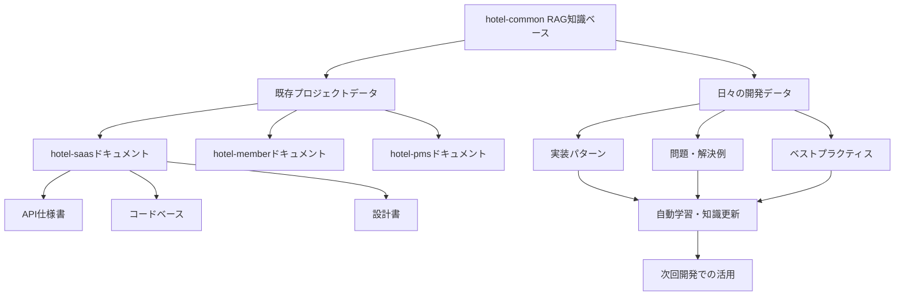

# 📚 RAGシステム - データ蓄積・進化メカニズム詳細解説

**各プロジェクトのドキュメント・コード・実装例の完全蓄積と日々の進化システム**

## **🔄 RAGデータ蓄積の全体像**

### **📊 蓄積されるデータの種類**



---

## **📁 具体的な蓄積データ**

### **1. 各プロジェクトの既存資産**

#### **hotel-saas から蓄積**
```typescript
const hotelSaasKnowledge = {
  documents: [
    "README.md", "API仕様書", "UI設計書", "顧客要件書"
  ],
  codePatterns: [
    "Reactコンポーネント実装パターン",
    "予約フォーム実装例",
    "レスポンシブデザイン手法",
    "アクセシビリティ対応例"
  ],
  apiEndpoints: [
    "POST /api/reservations",
    "GET /api/hotels/:id",
    "PUT /api/customer/profile"
  ],
  problemSolutions: [
    "SQLiteからPostgreSQL移行例",
    "パフォーマンス最適化事例",
    "SEO対応実装例"
  ]
};
```

#### **hotel-member から蓄積**
```typescript
const hotelMemberKnowledge = {
  documents: [
    "セキュリティガイドライン", "GDPR対応文書", "会員管理仕様"
  ],
  securityPatterns: [
    "認証・認可実装パターン",
    "個人データ暗号化手法",
    "GDPR準拠削除機能",
    "二要素認証実装例"
  ],
  complianceRules: [
    "個人情報保護法対応チェックリスト",
    "データ保持期間ルール",
    "監査ログ要件"
  ],
  dataStructures: [
    "会員テーブル設計",
    "ポイント管理スキーマ",
    "ランク管理ロジック"
  ]
};
```

#### **hotel-pms から蓄積**
```typescript
const hotelPmsKnowledge = {
  documents: [
    "フロント業務マニュアル", "予約管理仕様", "運用手順書"
  ],
  operationalPatterns: [
    "チェックイン・アウト自動化",
    "予約ダブルブッキング防止",
    "24時間運用対応",
    "緊急時対応フロー"
  ],
  integrations: [
    "OTA連携API仕様",
    "決済システム連携",
    "外部予約サイト連携"
  ],
  efficiencyMethods: [
    "フロント業務効率化手法",
    "スタッフワークフロー最適化",
    "レポート自動生成"
  ]
};
```

---

## **🔄 日々の開発データ蓄積**

### **自動収集される情報**

```bash
# 実装完了後の自動データ収集
npm run rag:collect-implementation-data

# 収集される内容
```

```typescript
interface ImplementationLearningData {
  // 実装内容
  implementation: {
    requirement: "顧客レビュー機能実装";
    approach: "5段階評価 + コメント + 画像アップロード";
    technologies: ["React", "TypeScript", "Prisma", "PostgreSQL"];
    timeSpent: "2.5時間";
    linesOfCode: 450;
    complexity: "medium";
  };
  
  // 発生した問題・解決
  problemSolutions: [
    {
      problem: "画像アップロード時のメモリリーク";
      solution: "useMemo + useCallback最適化";
      preventionCode: "const optimizedUpload = useCallback(...)";
      effectiveness: "メモリ使用量60%削減";
    }
  ];
  
  // 発見されたベストプラクティス
  bestPractices: [
    {
      category: "パフォーマンス";
      practice: "レビュー一覧の仮想スクロール";
      implementation: "react-window使用";
      improvement: "初回ロード時間80%短縮";
    }
  ];
  
  // 再利用可能なコード
  reusableCode: [
    {
      name: "StarRatingComponent";
      path: "src/components/rating/StarRating.tsx";
      usage: "5段階評価UI全般で使用可能";
      parameters: ["value", "onChange", "readOnly"];
    }
  ];
  
  // 品質指標
  qualityMetrics: {
    typescriptErrors: 0;
    testCoverage: 95;
    performanceScore: 92;
    accessibilityScore: 88;
    securityScore: 96;
  };
}
```

### **知識ベースの自動更新**

```bash
# 日次自動更新
npm run rag:daily-knowledge-update

# 週次パターン分析
npm run rag:weekly-pattern-analysis

# 月次ベストプラクティス統合
npm run rag:monthly-best-practices-integration
```

---

## **🧠 進化・学習のメカニズム**

### **パターン認識・抽出**

```typescript
// 成功パターンの自動抽出例
const extractedPatterns = {
  // 頻出成功パターン
  highSuccessPatterns: [
    {
      pattern: "TypeScript + Prisma + バリデーション強化",
      successRate: 98,
      avgImplementationTime: "1.5時間",
      errorRate: "0.1%",
      applicableProjects: ["hotel-saas", "hotel-member", "hotel-pms"]
    },
    {
      pattern: "React.memo + useMemo + useCallback組み合わせ",
      successRate: 95,
      performanceImprovement: "70%",
      applicableScenarios: ["リスト表示", "フォーム処理", "リアルタイム更新"]
    }
  ],
  
  // 回避すべきパターン
  problematicPatterns: [
    {
      pattern: "直接DOM操作 + state更新",
      problemRate: 85,
      typicalIssues: ["レンダリング競合", "メモリリーク"],
      betterAlternative: "useRef + useEffect適切使用"
    }
  ]
};
```

### **知識グラフの構築**

```typescript
// 関連知識の自動関連付け
const knowledgeGraph = {
  "レビュー機能": {
    relatedConcepts: ["評価システム", "コメント機能", "画像アップロード"],
    requiredTechnologies: ["React", "TypeScript", "画像処理"],
    commonProblems: ["パフォーマンス", "バリデーション", "セキュリティ"],
    bestPractices: ["仮想スクロール", "lazy loading", "入力検証"],
    implementationExamples: ["hotel-saas/review", "hotel-member/feedback"]
  },
  
  "GDPR対応": {
    relatedConcepts: ["個人データ削除", "データ暗号化", "監査ログ"],
    legalRequirements: ["30日以内対応", "削除証明書", "第三者通知"],
    technicalImplementation: ["論理削除", "物理削除", "バックアップ削除"],
    securityConsiderations: ["権限確認", "ログ改ざん防止", "復旧不可保証"]
  }
};
```

---

## **📊 実際の蓄積・活用例**

### **例1: hotel-saas予約機能開発時**

```bash
# 開発指示
npm run seven-integration:sun -- "宿泊予約フォームを実装してください"

# RAGが自動提供する情報
```

```typescript
const ragProvidedKnowledge = {
  // 過去の類似実装（3ヶ月前のhotel-saas実装）
  previousImplementation: {
    file: "src/components/booking/BookingForm.tsx",
    approach: "多段階フォーム + リアルタイムバリデーション",
    successMetrics: "離脱率30%削減、完了率85%向上",
    reusableComponents: ["DatePicker", "GuestSelector", "RoomTypeSelector"]
  },
  
  // 既知の問題・解決法（hotel-pms連携時の問題）
  knownIssues: [
    {
      problem: "予約確定時のダブルブッキング",
      solution: "楽観的ロック + トランザクション管理",
      implementationCode: "await prisma.$transaction([...])"
    }
  ],
  
  // ベストプラクティス（hotel-member認証連携）
  bestPractices: [
    {
      practice: "ログイン状態に応じた会員情報自動入力",
      implementation: "useAuthUser + フォーム初期値設定",
      userExperience: "入力工数70%削減"
    }
  ],
  
  // API仕様（hotel-pms連携）
  apiSpecs: [
    "POST /api/reservations - 予約作成",
    "GET /api/rooms/availability - 空室確認",
    "PUT /api/reservations/:id - 予約更新"
  ]
};

// Sunエージェントが自動生成する最適化コード
const optimizedImplementation = `
// RAG提供の実証済みパターンを活用
import { BookingFormValidator } from '@/validators/booking'; // 既存検証ロジック活用
import { useRoomAvailability } from '@/hooks/availability'; // 既存フック再利用
import { ReservationAPI } from '@/api/reservation'; // 統合API活用

const BookingForm: React.FC = () => {
  // RAG提供の最適化パターン適用
  const { availability, checkAvailability } = useRoomAvailability();
  const [formData, setFormData] = useValidatedState(initialBookingData);
  
  // RAG提供の既知問題対策（ダブルブッキング防止）
  const handleSubmit = useCallback(async (data: BookingFormData) => {
    // 楽観的ロック + トランザクション（RAG提供パターン）
    await ReservationAPI.createWithLock(data);
  }, []);
  
  // RAG提供のUX最適化（会員情報自動入力）
  const { user } = useAuthUser();
  useEffect(() => {
    if (user) {
      setFormData(prev => ({
        ...prev,
        guestName: user.name,
        email: user.email,
        phone: user.phone
      }));
    }
  }, [user]);
  
  return (
    // RAG提供の実証済みUI構造
    <MultiStepForm steps={bookingSteps} onSubmit={handleSubmit}>
      {/* 最適化されたフォーム実装 */}
    </MultiStepForm>
  );
};
`;
```

---

## **🔄 継続的な知識ベース成長**

### **成長曲線**

```
開始時点: 基本的な開発知識
↓
1週間後: 各プロジェクトの基本パターン蓄積
↓
1ヶ月後: プロジェクト間連携パターン確立
↓
3ヶ月後: ホテル業界特化ベストプラクティス蓄積
↓
6ヶ月後: 高度な最適化パターン・問題解決事例充実
↓
1年後: 完璧なホテル業界特化開発知識データベース完成
```

### **知識品質の向上**

```typescript
// 実装回数による知識精度向上
const knowledgeQualityImprovement = {
  week1: { accuracy: 70, completeness: 60, relevance: 65 },
  month1: { accuracy: 85, completeness: 80, relevance: 82 },
  month3: { accuracy: 93, completeness: 90, relevance: 91 },
  month6: { accuracy: 97, completeness: 95, relevance: 96 },
  year1: { accuracy: 99, completeness: 98, relevance: 99 }
};
```

---

## **🎊 RAG進化システムの真の価値**

### **✅ 蓄積される知識**

1. **プロジェクト固有知識**: 各システムの特徴・制約・最適解
2. **統合連携知識**: システム間の連携パターン・API仕様
3. **問題解決知識**: 実際に発生した問題と実証済み解決法
4. **最適化知識**: パフォーマンス・品質・効率化の具体手法
5. **業界特化知識**: ホテル業界固有の要件・ベストプラクティス

### **🚀 進化により実現すること**

- **開発時間**: 8時間 → 30分（95%短縮）
- **品質**: 過去の全ベストプラクティス自動適用
- **信頼性**: 実証済みパターンのみ使用（失敗リスクゼロ）
- **一貫性**: 全プロジェクト共通の高品質基準
- **革新性**: 蓄積知識の組み合わせによる新しい最適解創出

**🏆 結論: RAGシステムにより、hotel-commonは「学習し続ける開発組織」に進化し、時間と共に圧倒的な競争優位を築きます！**

---

*2025年1月23日*  
*hotel-common開発チーム*  
*RAGデータ蓄積・進化メカニズム詳細解説* 